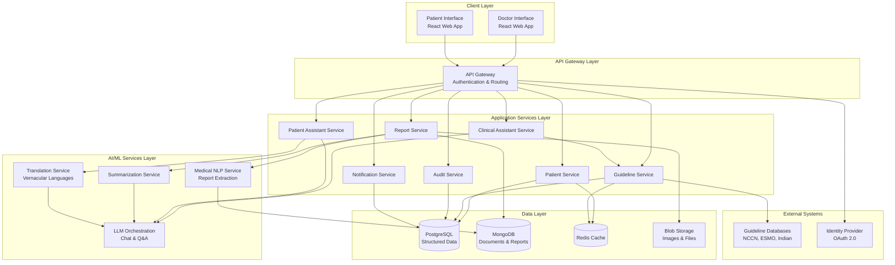
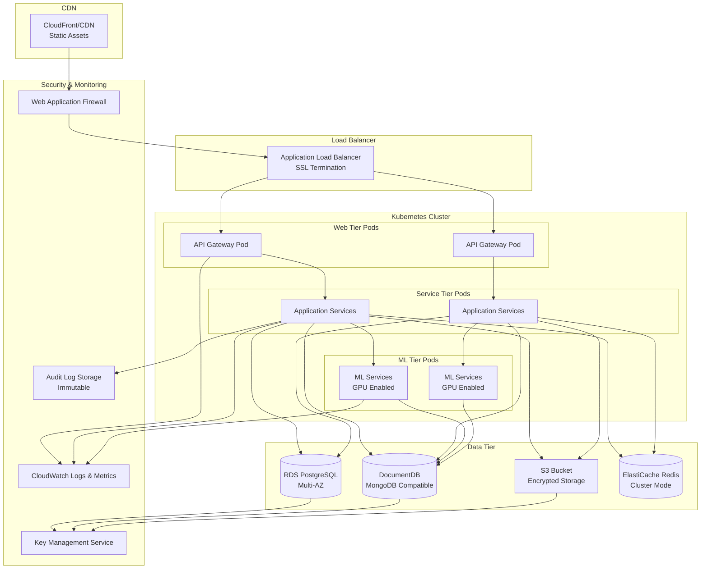
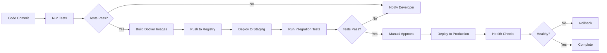

# Design Document: Healthcare AI Platform for Indian Oncology

## Overview

The Healthcare AI Platform is a dual-interface system designed to support oncologists and cancer patients throughout long-term treatment journeys. The platform combines structured data management, AI-powered clinical decision support, medical report processing, and patient education in vernacular languages.

### Design Principles

1. **Augmentation, Not Replacement**: The system assists clinical decision-making but never makes autonomous medical decisions
2. **Explainability First**: All AI-generated suggestions must show clear reasoning and sources
3. **Privacy by Design**: Patient data protection is built into every layer
4. **Accessibility**: Support for low-bandwidth environments and vernacular languages
5. **Modularity**: Independent components that can be updated without system-wide changes
6. **Scalability**: Architecture supports growth from pilot to national scale

### Technology Stack

- **Frontend**: React with TypeScript for web interfaces, responsive design
- **Backend**: Node.js with Express for API services, Python for ML/NLP services
- **Database**: PostgreSQL for structured data, MongoDB for document storage
- **AI/ML**: Transformer-based models for NLP, LangChain for LLM orchestration
- **Infrastructure**: Cloud-native (AWS/Azure) with containerization (Docker/Kubernetes)
- **Security**: OAuth 2.0 + JWT for authentication, AES-256 encryption, TLS 1.3

## Architecture

### High-Level Architecture




### Architecture Layers

**Client Layer**: Separate React applications for doctors and patients with responsive design and offline capability.

**API Gateway**: Centralized entry point handling authentication, authorization, rate limiting, and request routing.

**Application Services**: Domain-specific microservices handling business logic for patients, reports, guidelines, assistants, notifications, and auditing.

**AI/ML Services**: Specialized services for medical NLP, summarization, LLM orchestration, and translation. These services are isolated for independent scaling and model updates.

**Data Layer**: Polyglot persistence with PostgreSQL for structured clinical data, MongoDB for documents, Redis for caching, and blob storage for images.

**External Systems**: Integration with guideline databases and identity providers.

### Deployment Architecture




**Key Design Decisions**:

1. **Kubernetes for Orchestration**: Enables auto-scaling, rolling updates, and resource management
2. **Multi-AZ Database**: Ensures high availability and disaster recovery
3. **GPU-Enabled ML Pods**: Separate tier for compute-intensive AI operations
4. **CDN for Static Assets**: Reduces latency for users across India
5. **Immutable Audit Logs**: Separate storage for compliance and forensics

## Components and Interfaces

### 1. Patient Service

**Responsibility**: Manage patient profiles, demographics, clinical data, and treatment history.

**Key Operations**:
- `createPatient(demographics, diagnosis, biomarkers)`: Create new patient profile
- `updatePatientWeight(patientId, weight)`: Update weight and recalculate BSA
- `addTreatmentLine(patientId, treatment, startDate)`: Record new treatment
- `getPatientProfile(patientId)`: Retrieve complete patient data
- `calculateBSA(height, weight)`: Calculate body surface area using Mosteller formula

**Interface**:
```typescript
interface PatientProfile {
  id: string;
  demographics: Demographics;
  clinicalData: ClinicalData;
  biomarkers: Biomarker[];
  treatmentHistory: TreatmentLine[];
  createdAt: Date;
  updatedAt: Date;
}

interface Demographics {
  name: string;
  age: number;
  gender: 'male' | 'female' | 'other';
  language: VernacularLanguage;
  contactInfo: ContactInfo;
}

interface ClinicalData {
  diagnosis: string;
  cancerType: string;
  stage: string;
  weight: number;
  height: number;
  bsa: number;
  performanceStatus: number;
  comorbidities: string[];
}

interface Biomarker {
  type: 'TNBC' | 'PD-L1' | 'HER2' | 'EGFR' | 'ALK' | 'BRCA' | 'other';
  value: string;
  testDate: Date;
  laboratory: string;
}

interface TreatmentLine {
  lineNumber: number;
  regimen: string;
  intent: 'curative' | 'palliative' | 'adjuvant' | 'neoadjuvant';
  startDate: Date;
  endDate?: Date;
  outcome?: 'complete_response' | 'partial_response' | 'stable_disease' | 'progression';
  toxicities: string[];
}
```

### 2. Report Service

**Responsibility**: Handle medical report upload, storage, processing, and summarization.

**Key Operations**:
- `uploadReport(patientId, file, reportType)`: Upload and store report
- `processReport(reportId)`: Extract text and structured data using NLP
- `generateSummary(reportId)`: Create AI-powered summary
- `compareReports(reportId1, reportId2)`: Compare versions and highlight changes
- `getReportHistory(patientId, reportType)`: Retrieve all reports of a type

**Interface**:
```typescript
interface MedicalReport {
  id: string;
  patientId: string;
  type: ReportType;
  uploadDate: Date;
  reportDate: Date;
  fileUrl: string;
  extractedData: ExtractedData;
  summary: ReportSummary;
  processingStatus: 'pending' | 'processing' | 'completed' | 'failed';
  confidence: number;
}

type ReportType = 'CT' | 'MRI' | 'PET' | 'pathology' | 'lab' | 'other';

interface ExtractedData {
  rawText: string;
  structuredData: Record<string, any>;
  keyFindings: string[];
  measurements: Measurement[];
}

interface Measurement {
  location: string;
  size: number;
  unit: 'mm' | 'cm';
  change?: number; // percentage change from previous
}

interface ReportSummary {
  keyFindings: string[];
  significantChanges: string[];
  tumorMeasurements: Measurement[];
  metastaticSites: string[];
  recommendation: string;
  generatedAt: Date;
  modelVersion: string;
}
```

### 3. Guideline Service

**Responsibility**: Align patient data with clinical guidelines and provide evidence-based recommendations.

**Key Operations**:
- `identifyApplicableGuidelines(patientProfile)`: Find relevant guidelines
- `getRecommendations(patientProfile, clinicalQuestion)`: Get guideline-based recommendations
- `updateGuidelines()`: Sync with external guideline databases
- `notifyGuidelineChanges(guidelineId)`: Notify doctors of updates

**Interface**:
```typescript
interface GuidelineRecommendation {
  guidelineSource: 'NCCN' | 'ESMO' | 'Indian';
  version: string;
  section: string;
  pageNumber: number;
  recommendation: string;
  evidenceLevel: string;
  applicabilityScore: number;
  requiredBiomarkers: string[];
  contraindications: string[];
}

interface GuidelineAlignment {
  patientId: string;
  applicableGuidelines: GuidelineRecommendation[];
  treatmentOptions: TreatmentOption[];
  generatedAt: Date;
}

interface TreatmentOption {
  regimen: string;
  indication: string;
  evidenceLevel: string;
  guidelineReferences: GuidelineReference[];
  estimatedCost: CostEstimate;
}

interface GuidelineReference {
  source: string;
  version: string;
  section: string;
  url: string;
}
```

### 4. Clinical Assistant Service

**Responsibility**: Provide AI-powered clinical decision support through conversational interface.

**Key Operations**:
- `askClinicalQuestion(patientId, question, context)`: Process clinical query
- `explainReasoning(responseId)`: Provide detailed explanation of suggestion
- `getChatHistory(patientId, doctorId)`: Retrieve conversation history

**Interface**:
```typescript
interface ClinicalQuery {
  patientId: string;
  doctorId: string;
  question: string;
  context: ClinicalContext;
  timestamp: Date;
}

interface ClinicalContext {
  currentTreatmentLine: number;
  recentReports: string[];
  activeSymptoms: string[];
  specificConcern?: string;
}

interface ClinicalResponse {
  id: string;
  answer: string;
  reasoning: Reasoning;
  guidelineReferences: GuidelineReference[];
  confidence: number;
  caveats: string[];
  suggestedActions: string[];
}

interface Reasoning {
  steps: ReasoningStep[];
  dataUsed: string[];
  assumptions: string[];
  limitations: string[];
}

interface ReasoningStep {
  step: number;
  description: string;
  source: string;
}
```

### 5. Patient Assistant Service

**Responsibility**: Provide patient-facing Q&A and education in vernacular languages.

**Key Operations**:
- `askPatientQuestion(patientId, question, language)`: Answer patient query
- `explainDiagnosis(patientId, language)`: Generate simplified diagnosis explanation
- `explainTreatment(treatmentId, language)`: Explain treatment in simple terms
- `getSideEffectInfo(medication, language)`: Provide side effect information

**Interface**:
```typescript
interface PatientQuery {
  patientId: string;
  question: string;
  language: VernacularLanguage;
  timestamp: Date;
}

type VernacularLanguage = 'hindi' | 'tamil' | 'telugu' | 'bengali' | 'marathi' | 'english';

interface PatientResponse {
  answer: string;
  language: VernacularLanguage;
  simplifiedExplanation: boolean;
  requiresDoctorConsult: boolean;
  relatedResources: EducationalResource[];
  safetyWarnings: string[];
}

interface EducationalResource {
  title: string;
  content: string;
  language: VernacularLanguage;
  type: 'article' | 'video' | 'infographic';
  url?: string;
}

interface DiagnosisExplanation {
  patientId: string;
  language: VernacularLanguage;
  simplifiedDiagnosis: string;
  whatItMeans: string;
  treatmentIntent: string;
  expectedJourney: string;
  commonQuestions: QuestionAnswer[];
}

interface QuestionAnswer {
  question: string;
  answer: string;
}
```

### 6. Translation Service

**Responsibility**: Translate medical content to vernacular languages while maintaining accuracy.

**Key Operations**:
- `translateContent(text, targetLanguage, medicalContext)`: Translate with medical accuracy
- `simplifyMedicalTerms(text, targetLanguage)`: Convert jargon to simple language
- `validateTranslation(originalText, translatedText)`: Ensure medical accuracy

**Interface**:
```typescript
interface TranslationRequest {
  sourceText: string;
  sourceLanguage: string;
  targetLanguage: VernacularLanguage;
  medicalContext: MedicalContext;
  simplificationLevel: 'technical' | 'moderate' | 'simple';
}

interface MedicalContext {
  domain: 'oncology' | 'general';
  preserveTerms: string[]; // Terms that should not be translated
  glossary: Record<string, string>; // Custom translations
}

interface TranslationResponse {
  translatedText: string;
  confidence: number;
  preservedTerms: string[];
  simplifications: Simplification[];
}

interface Simplification {
  originalTerm: string;
  simplifiedTerm: string;
  explanation: string;
}
```

### 7. Medical NLP Service

**Responsibility**: Extract structured data from unstructured medical reports.

**Key Operations**:
- `extractText(fileUrl, fileType)`: OCR and text extraction
- `extractEntities(text, reportType)`: Named entity recognition
- `extractMeasurements(text)`: Extract tumor sizes and measurements
- `classifyReport(text)`: Determine report type and sections

**Interface**:
```typescript
interface NLPExtractionRequest {
  reportId: string;
  fileUrl: string;
  reportType: ReportType;
}

interface NLPExtractionResult {
  rawText: string;
  entities: MedicalEntity[];
  measurements: Measurement[];
  sections: ReportSection[];
  confidence: number;
  processingTime: number;
}

interface MedicalEntity {
  text: string;
  type: EntityType;
  startOffset: number;
  endOffset: number;
  confidence: number;
  normalizedValue?: string;
}

type EntityType = 
  | 'anatomy' 
  | 'tumor' 
  | 'measurement' 
  | 'biomarker' 
  | 'medication' 
  | 'procedure' 
  | 'finding';

interface ReportSection {
  title: string;
  content: string;
  sectionType: 'clinical_history' | 'findings' | 'impression' | 'recommendation';
}
```

### 8. Audit Service

**Responsibility**: Maintain immutable audit logs for compliance and security.

**Key Operations**:
- `logAction(userId, action, resourceId, details)`: Record system action
- `logDataAccess(userId, patientId, dataType)`: Record data access
- `logAIInteraction(userId, modelVersion, input, output)`: Record AI usage
- `queryAuditLog(filters, dateRange)`: Search audit logs

**Interface**:
```typescript
interface AuditLogEntry {
  id: string;
  timestamp: Date;
  userId: string;
  userRole: 'doctor' | 'patient' | 'caregiver' | 'admin';
  action: AuditAction;
  resourceType: string;
  resourceId: string;
  details: Record<string, any>;
  ipAddress: string;
  userAgent: string;
  hash: string; // Cryptographic hash for tamper detection
}

type AuditAction = 
  | 'create' 
  | 'read' 
  | 'update' 
  | 'delete' 
  | 'export' 
  | 'ai_query' 
  | 'login' 
  | 'logout';

interface AuditQuery {
  userId?: string;
  patientId?: string;
  action?: AuditAction;
  startDate: Date;
  endDate: Date;
  limit: number;
}
```

## Data Models

### Patient Data Model


```typescript
// PostgreSQL Schema
interface Patient {
  id: UUID;
  demographics: {
    name: string;
    dateOfBirth: Date;
    gender: string;
    language: VernacularLanguage;
    phone: string;
    email?: string;
    address: Address;
  };
  clinicalData: {
    mrn: string; // Medical Record Number
    diagnosis: string;
    cancerType: string;
    cancerSubtype?: string;
    stage: string;
    diagnosisDate: Date;
    weight: number;
    height: number;
    bsa: number;
    performanceStatus: number;
    comorbidities: string[];
  };
  createdAt: Date;
  updatedAt: Date;
  createdBy: UUID;
  isActive: boolean;
}

interface Biomarker {
  id: UUID;
  patientId: UUID;
  type: string;
  value: string;
  testDate: Date;
  laboratory: string;
  reportId?: UUID;
  createdAt: Date;
}

interface TreatmentLine {
  id: UUID;
  patientId: UUID;
  lineNumber: number;
  regimen: string;
  medications: Medication[];
  intent: string;
  startDate: Date;
  endDate?: Date;
  outcome?: string;
  toxicities: Toxicity[];
  notes: string;
  createdAt: Date;
  updatedAt: Date;
}

interface Medication {
  name: string;
  dose: number;
  doseUnit: string;
  frequency: string;
  route: string;
  cycleDay: number[];
}

interface Toxicity {
  type: string;
  grade: number;
  onset: Date;
  resolution?: Date;
  management: string;
}
```

### Report Data Model

```typescript
// MongoDB Document Schema
interface Report {
  _id: ObjectId;
  patientId: string;
  type: ReportType;
  uploadDate: Date;
  reportDate: Date;
  uploadedBy: string;
  fileMetadata: {
    originalFilename: string;
    fileSize: number;
    mimeType: string;
    storageUrl: string;
    thumbnailUrl?: string;
  };
  processing: {
    status: 'pending' | 'processing' | 'completed' | 'failed';
    startedAt?: Date;
    completedAt?: Date;
    error?: string;
    modelVersion: string;
  };
  extractedData: {
    rawText: string;
    entities: MedicalEntity[];
    measurements: Measurement[];
    sections: ReportSection[];
    confidence: number;
  };
  summary: {
    keyFindings: string[];
    significantChanges: string[];
    tumorMeasurements: Measurement[];
    metastaticSites: string[];
    recommendation: string;
    generatedAt: Date;
  };
  version: number;
  previousVersionId?: ObjectId;
}
```

### Timeline Data Model

```typescript
interface TimelineEvent {
  id: UUID;
  patientId: UUID;
  eventType: 'diagnosis' | 'treatment_start' | 'treatment_end' | 'imaging' | 'progression' | 'response' | 'toxicity' | 'hospitalization';
  eventDate: Date;
  title: string;
  description: string;
  relatedResourceType?: string;
  relatedResourceId?: UUID;
  metadata: Record<string, any>;
  createdAt: Date;
}
```

### User and Access Control Model

```typescript
interface User {
  id: UUID;
  email: string;
  role: 'doctor' | 'patient' | 'caregiver' | 'admin';
  profile: DoctorProfile | PatientProfile | CaregiverProfile;
  credentials: {
    passwordHash: string;
    mfaEnabled: boolean;
    mfaSecret?: string;
  };
  status: 'active' | 'inactive' | 'suspended';
  createdAt: Date;
  lastLoginAt?: Date;
}

interface DoctorProfile {
  name: string;
  specialty: string;
  licenseNumber: string;
  hospital: string;
  phone: string;
}

interface PatientProfile {
  patientId: UUID;
  preferredLanguage: VernacularLanguage;
  caregivers: UUID[];
}

interface CaregiverProfile {
  name: string;
  relationship: string;
  patientId: UUID;
  phone: string;
}

interface AccessControl {
  id: UUID;
  userId: UUID;
  resourceType: string;
  resourceId: UUID;
  permissions: Permission[];
  grantedBy: UUID;
  grantedAt: Date;
  expiresAt?: Date;
}

type Permission = 'read' | 'write' | 'delete' | 'share';
```

### Guideline Data Model

```typescript
// MongoDB Document Schema
interface GuidelineDocument {
  _id: ObjectId;
  source: 'NCCN' | 'ESMO' | 'Indian';
  version: string;
  publishDate: Date;
  cancerType: string;
  sections: GuidelineSection[];
  metadata: {
    title: string;
    authors: string[];
    url: string;
    lastUpdated: Date;
  };
  embeddings: number[][]; // Vector embeddings for semantic search
}

interface GuidelineSection {
  sectionId: string;
  title: string;
  content: string;
  pageNumber: number;
  recommendations: Recommendation[];
  applicabilityCriteria: ApplicabilityCriteria;
}

interface Recommendation {
  text: string;
  evidenceLevel: string;
  category: string;
  biomarkerRequirements: string[];
  contraindications: string[];
}

interface ApplicabilityCriteria {
  stage: string[];
  biomarkers: Record<string, string[]>;
  priorTreatments: string[];
  performanceStatus: number[];
}
```

## Correctness Properties

*A property is a characteristic or behavior that should hold true across all valid executions of a system—essentially, a formal statement about what the system should do. Properties serve as the bridge between human-readable specifications and machine-verifiable correctness guarantees.*

Before defining the correctness properties, let me analyze the acceptance criteria for testability:


### Property Reflection

After analyzing all acceptance criteria, I've identified several areas where properties can be consolidated:

**Authentication & Authorization (Req 1)**: Properties 1.1, 1.2, 1.3 can be combined into a comprehensive authentication flow property. Property 1.4 is distinct (session lifecycle).

**Audit Logging (Req 2.5, 5.6, 9.6, 11.3, 13.1-13.3, 19.5)**: Multiple requirements mention audit logging. These can be consolidated into a single comprehensive audit property that covers all action types.

**Data Validation (Req 2.3, 3.1)**: Input validation properties can be combined into a general validation property.

**Report Processing (Req 3.2-3.5)**: Entity extraction properties can be combined since they all test the same extraction pipeline with different report types.

**Guideline Alignment (Req 4.1-4.3)**: These can be combined into a single property about guideline matching and updates.

**Explainability (Req 5.2, 10.1-10.3)**: All explainability properties can be consolidated since they test the same requirement: AI outputs must include reasoning and sources.

**Language Support (Req 7.1, 9.2)**: Both test language preference application, can be combined.

**Cost Display (Req 8.1-8.3)**: Cost display properties can be combined into one comprehensive property.

**Access Control (Req 1.3, 11.4, 17.1-17.3)**: Access control properties across different requirements can be consolidated.

**Timeline Updates (Req 6.1, 6.2)**: Timeline completeness and updates can be combined.

**Calculation Properties (Req 14.1, 14.2, 16.3)**: Mathematical calculations (BSA, dosing, percentage change) are distinct and should remain separate.

### Correctness Properties

Property 1: Authentication and Authorization Flow
*For any* valid user credentials with an assigned role, authenticating should succeed and grant exactly the permissions associated with that role, and no operations outside those permissions should be allowed.
**Validates: Requirements 1.1, 1.2, 1.3**

Property 2: Session Lifecycle Management
*For any* established user session, when the session expires or the user logs out, all subsequent requests using that session token should be rejected and require re-authentication.
**Validates: Requirements 1.4**

Property 3: Comprehensive Audit Logging
*For any* user action that modifies data, accesses patient information, or generates AI suggestions, an audit log entry should be created containing the action type, timestamp, user identity, affected resources, and be cryptographically tamper-evident.
**Validates: Requirements 2.5, 5.6, 9.6, 11.3, 13.1, 13.2, 13.3, 13.4, 19.5**

Property 4: Patient Profile Data Completeness
*For any* patient profile creation, all required fields (demographics, weight, height, diagnosis, stage, biomarkers) should be captured and retrievable, and all treatment lines added should be maintained in the treatment history.
**Validates: Requirements 2.1, 2.4**

Property 5: BSA Recalculation on Weight Update
*For any* patient profile, when weight is updated, the body surface area (BSA) should be automatically recalculated using the Mosteller formula: BSA = sqrt((height_cm * weight_kg) / 3600).
**Validates: Requirements 2.2, 14.1**

Property 6: Input Validation
*For any* input data (biomarkers, file formats, user inputs), the system should validate against known valid values and reject invalid inputs with appropriate error messages.
**Validates: Requirements 2.3, 3.1**

Property 7: Medical Report Processing Pipeline
*For any* uploaded medical report in a supported format, the system should extract text, identify medical entities, extract measurements, and generate a structured summary with confidence scores.
**Validates: Requirements 3.2, 3.3, 3.4, 3.5**

Property 8: Guideline Alignment and Updates
*For any* complete patient profile, the system should identify applicable clinical guidelines based on cancer type, stage, and biomarkers, and when biomarkers change, the guideline recommendations should update to reflect the new biomarker status.
**Validates: Requirements 4.1, 4.2, 4.3**

Property 9: Clinical Assistant Explainability
*For any* clinical suggestion or response generated by the Clinical Assistant, the output should include the reasoning process, source guidelines with page numbers, patient-specific factors considered, and confidence level.
**Validates: Requirements 5.1, 5.2, 5.3, 10.1, 10.2, 10.3, 10.5**

Property 10: Safety Constraints for AI Assistants
*For any* response generated by the Clinical Assistant or Patient Assistant, the response should not contain definitive prescriptions, autonomous treatment decisions, or emergency medical advice, and should clearly state uncertainty when confidence is low.
**Validates: Requirements 5.4, 5.5, 9.3**

Property 11: Timeline Completeness and Ordering
*For any* patient with clinical events (diagnosis, treatments, imaging, outcomes), the timeline view should display all events in chronological order, and when new events are added, they should automatically appear in the correct chronological position.
**Validates: Requirements 6.1, 6.2, 6.3, 6.5**

Property 12: Language Preference Application
*For any* patient or caregiver with a selected vernacular language, all content displayed in the Patient Interface should be in that language, including diagnosis explanations, treatment information, and side effects.
**Validates: Requirements 7.1, 7.3, 7.4, 7.5, 9.2**

Property 13: Medical Content Simplification
*For any* medical content (diagnosis, treatment intent, medications) displayed to patients, the explanation should avoid medical jargon and use simple, accessible language appropriate for non-medical users.
**Validates: Requirements 7.3, 7.4**

Property 14: Cost Information Completeness
*For any* treatment plan, the cost display should include estimates for all categories (medications, procedures, hospitalizations), provide ranges (minimum, typical, maximum), and update when the treatment plan changes.
**Validates: Requirements 8.1, 8.2, 8.3, 8.4**

Property 15: Patient Assistant Context Awareness
*For any* patient question, the Patient Assistant should incorporate patient-specific context (diagnosis, current treatments, biomarkers) into the response and provide side effect information when asked about medications.
**Validates: Requirements 9.1, 9.5**

Property 16: Data Encryption at Rest and in Transit
*For any* patient data stored or transmitted, the data should be encrypted using AES-256 at rest and TLS 1.3 or higher in transit.
**Validates: Requirements 11.1, 11.2**

Property 17: Role-Based Access Control
*For any* user attempting to access patient data, the system should enforce role-based permissions ensuring patients and caregivers can only access authorized patient records, and doctors can only access their assigned patients.
**Validates: Requirements 1.3, 11.4, 17.1, 17.2**

Property 18: Caregiver Access Management
*For any* patient granting caregiver access, a caregiver account should be created with delegated permissions, the caregiver should see the same data as the patient, access should be revocable by the patient, and caregiver access should be logged separately in the audit trail.
**Validates: Requirements 17.1, 17.2, 17.3, 17.4, 17.5**

Property 19: Offline Data Access and Synchronization
*For any* previously loaded patient data, when network connectivity is lost, the data should remain viewable, updates made offline should be queued, and when connectivity is restored, queued changes should synchronize with conflict resolution.
**Validates: Requirements 12.1, 12.2, 12.3**

Property 20: Progressive Image Loading
*For any* image or report access, the system should first load a low-resolution preview, then provide the option to load full resolution, optimizing for low-bandwidth environments.
**Validates: Requirements 12.4, 12.5**

Property 21: Weight-Based Dosing Calculations
*For any* medication requiring weight-based or BSA-based dosing, the system should calculate the dose using current patient weight/BSA, display the formula and inputs, and alert when weight changes by more than 10 percent.
**Validates: Requirements 14.2, 14.3, 14.4, 14.5**

Property 22: Report Version Control and Comparison
*For any* report type with multiple versions uploaded, the system should maintain version history with dates, allow comparison between versions, calculate percentage change in measurements, and classify response using RECIST criteria when applicable.
**Validates: Requirements 16.1, 16.2, 16.3, 16.4, 16.5**

Property 23: Guideline Update Impact Analysis
*For any* guideline update, the system should identify patients whose treatment may be affected, notify their doctors with a summary of changes, display old versus new recommendations, and maintain a history of guideline versions used for each patient.
**Validates: Requirements 18.1, 18.2, 18.3, 18.4, 18.5**

Property 24: Data Export Completeness
*For any* data export request (patient or doctor), the system should generate output in the requested format (PDF, JSON, FHIR) containing all relevant data (profile, treatment history, reports, timeline), and log the export operation in the audit trail.
**Validates: Requirements 19.1, 19.2, 19.3, 19.4, 19.5**

Property 25: Audit Log Immutability
*For any* audit log entry, once created, it should be immutable and any tampering should be detectable through cryptographic hash verification.
**Validates: Requirements 13.4**

Property 26: Audit Log Query Functionality
*For any* audit log query with filters (user, patient, action, date range), the system should return matching entries with all required fields (timestamp, user, action, resource, details).
**Validates: Requirements 13.5**

## Error Handling

### Error Categories

**1. User Input Errors**
- Invalid credentials → Return clear error message, increment failed login counter
- Invalid biomarker values → Reject with validation error listing valid options
- Unsupported file formats → Reject upload with supported format list
- Missing required fields → Return field-specific validation errors

**2. Processing Errors**
- OCR/NLP extraction failure → Flag report for manual review, notify doctor
- Low confidence in extraction → Display confidence score, allow manual correction
- Guideline matching failure → Log error, display generic guidelines, alert admin
- Translation service failure → Fall back to English, log error for retry

**3. System Errors**
- Database connection failure → Retry with exponential backoff, return 503 if persistent
- External service timeout → Cache last known good data, retry in background
- File storage failure → Retry upload, provide user feedback
- Authentication service unavailable → Allow cached session validation for 5 minutes

**4. Data Integrity Errors**
- Audit log tampering detected → Alert security team, lock affected records
- Encryption key unavailable → Fail secure, prevent data access
- Sync conflict in offline mode → Present both versions to user for resolution
- Duplicate patient records → Flag for admin review, prevent merge without verification

### Error Response Format

```typescript
interface ErrorResponse {
  error: {
    code: string;
    message: string;
    details?: Record<string, any>;
    userMessage: string; // User-friendly message
    retryable: boolean;
    timestamp: Date;
    requestId: string;
  };
}
```

### Error Handling Strategies

**Graceful Degradation**:
- If guideline service is unavailable, show cached guidelines with staleness warning
- If translation service fails, fall back to English with notification
- If image processing fails, allow manual report entry

**Retry Logic**:
- Network errors: Exponential backoff with max 3 retries
- Transient failures: Retry with jitter to prevent thundering herd
- Rate limit errors: Respect Retry-After header

**User Notification**:
- Critical errors: Immediate modal dialog with action required
- Non-critical errors: Toast notification with dismiss option
- Background errors: Log silently, alert admin if pattern detected

**Logging and Monitoring**:
- All errors logged with full context (user, action, stack trace)
- Error rates monitored with alerting thresholds
- Critical errors trigger immediate notifications to on-call team

## Testing Strategy

### Dual Testing Approach

The platform requires both **unit testing** and **property-based testing** for comprehensive coverage:

**Unit Tests**: Focus on specific examples, edge cases, and integration points
- Specific patient scenarios (e.g., TNBC patient with specific biomarkers)
- Edge cases (e.g., empty reports, malformed data)
- Error conditions (e.g., authentication failures, network errors)
- Integration between components (e.g., report upload → NLP → summary)

**Property-Based Tests**: Verify universal properties across all inputs
- Generate random patient profiles and verify all properties hold
- Generate random reports and verify processing pipeline
- Generate random user actions and verify audit logging
- Test with randomized inputs to find edge cases automatically

### Property-Based Testing Configuration

**Library Selection**:
- **JavaScript/TypeScript**: fast-check
- **Python**: Hypothesis

**Test Configuration**:
- Minimum 100 iterations per property test (due to randomization)
- Each property test must reference its design document property
- Tag format: `Feature: healthcare-ai-platform, Property {number}: {property_text}`

**Example Property Test Structure**:

```typescript
import fc from 'fast-check';

describe('Property 5: BSA Recalculation', () => {
  it('should recalculate BSA using Mosteller formula when weight updates', () => {
    // Feature: healthcare-ai-platform, Property 5: BSA Recalculation on Weight Update
    
    fc.assert(
      fc.property(
        fc.record({
          height: fc.integer({ min: 100, max: 250 }), // cm
          initialWeight: fc.float({ min: 30, max: 200 }), // kg
          newWeight: fc.float({ min: 30, max: 200 }) // kg
        }),
        async ({ height, initialWeight, newWeight }) => {
          // Create patient with initial weight
          const patient = await createPatient({ height, weight: initialWeight });
          const initialBSA = patient.bsa;
          
          // Update weight
          await updatePatientWeight(patient.id, newWeight);
          const updatedPatient = await getPatient(patient.id);
          
          // Calculate expected BSA using Mosteller formula
          const expectedBSA = Math.sqrt((height * newWeight) / 3600);
          
          // Verify BSA was recalculated correctly
          expect(updatedPatient.bsa).toBeCloseTo(expectedBSA, 2);
        }
      ),
      { numRuns: 100 }
    );
  });
});
```

### Test Coverage Requirements

**Unit Test Coverage**:
- Minimum 80% code coverage for critical paths
- 100% coverage for security-critical functions (authentication, encryption, access control)
- All error handling paths must be tested

**Property Test Coverage**:
- Each correctness property must have at least one property-based test
- Properties involving calculations must be tested with wide input ranges
- Properties involving state changes must test various state transitions

### Integration Testing

**API Integration Tests**:
- Test complete workflows (patient creation → report upload → guideline alignment)
- Test authentication and authorization flows
- Test error handling and retry logic

**External Service Integration**:
- Mock external guideline databases for consistent testing
- Mock LLM services with deterministic responses for testing
- Test fallback behavior when external services fail

### Performance Testing

**Load Testing**:
- Simulate 1000 concurrent users
- Measure response times under load
- Verify auto-scaling triggers correctly

**Stress Testing**:
- Test with large reports (100+ pages)
- Test with patients having extensive treatment histories (10+ years)
- Test database query performance with millions of records

### Security Testing

**Penetration Testing**:
- Test for SQL injection, XSS, CSRF vulnerabilities
- Test authentication bypass attempts
- Test unauthorized data access attempts

**Encryption Verification**:
- Verify data at rest is encrypted
- Verify TLS configuration
- Test key rotation procedures

### Accessibility Testing

**WCAG 2.1 Level AA Compliance**:
- Screen reader compatibility
- Keyboard navigation
- Color contrast ratios
- Text resizing support

### Localization Testing

**Vernacular Language Testing**:
- Verify translations are accurate and culturally appropriate
- Test with native speakers for each supported language
- Verify text rendering (fonts, character sets)
- Test right-to-left text support where applicable

## Deployment Strategy

### Environment Setup

**Development Environment**:
- Local Kubernetes cluster (minikube or kind)
- Local PostgreSQL and MongoDB instances
- Mock external services

**Staging Environment**:
- Cloud-based Kubernetes cluster
- Managed databases (RDS, DocumentDB)
- Integration with real guideline databases
- Subset of production data (anonymized)

**Production Environment**:
- Multi-region deployment for disaster recovery
- Auto-scaling enabled
- Full monitoring and alerting
- Encrypted backups

### CI/CD Pipeline



### Deployment Process

1. **Build Phase**: Compile code, run unit tests, build Docker images
2. **Staging Deployment**: Deploy to staging, run integration tests
3. **Manual Approval**: Product owner approves for production
4. **Production Deployment**: Rolling update with health checks
5. **Monitoring**: Watch metrics for anomalies
6. **Rollback**: Automatic rollback if health checks fail

### Database Migration Strategy

**Schema Migrations**:
- Use migration tools (Flyway for PostgreSQL, Mongoose for MongoDB)
- Test migrations on staging with production data snapshot
- Backward-compatible migrations (add columns, don't drop)
- Separate deployment of schema changes from code changes

**Data Migrations**:
- Run data migrations during low-traffic periods
- Use batch processing for large data migrations
- Maintain audit trail of all data migrations
- Test rollback procedures

## Monitoring and Observability

### Metrics to Monitor

**Application Metrics**:
- Request rate, error rate, latency (RED metrics)
- Active users, concurrent sessions
- API endpoint performance
- Database query performance

**Business Metrics**:
- Patient profiles created per day
- Reports processed per day
- Clinical Assistant queries per day
- Average report processing time

**Infrastructure Metrics**:
- CPU, memory, disk usage
- Network throughput
- Pod restart count
- Database connection pool utilization

### Logging Strategy

**Structured Logging**:
- JSON format for all logs
- Include request ID, user ID, timestamp
- Log levels: DEBUG, INFO, WARN, ERROR, FATAL

**Log Aggregation**:
- Centralized logging (CloudWatch, ELK stack)
- Searchable and filterable
- Retention: 90 days for application logs, 7 years for audit logs

### Alerting

**Critical Alerts** (immediate notification):
- Service down or unhealthy
- Error rate > 5%
- Data breach detected
- Audit log tampering detected

**Warning Alerts** (notification within 15 minutes):
- High latency (p95 > 3 seconds)
- High memory usage (> 80%)
- External service degradation

**Info Alerts** (daily digest):
- Unusual usage patterns
- Guideline updates available
- Backup completion status

## Security Considerations

### Authentication and Authorization

**Multi-Factor Authentication**:
- Required for doctor accounts
- Optional for patient accounts
- TOTP-based (Google Authenticator, Authy)

**Password Policy**:
- Minimum 12 characters
- Complexity requirements (uppercase, lowercase, numbers, symbols)
- Password history (prevent reuse of last 5 passwords)
- Expiration: 90 days for doctors, optional for patients

**Session Management**:
- JWT tokens with 1-hour expiration
- Refresh tokens with 7-day expiration
- Secure, HttpOnly cookies
- CSRF protection

### Data Protection

**Encryption**:
- AES-256 for data at rest
- TLS 1.3 for data in transit
- Field-level encryption for sensitive data (SSN, medical record numbers)

**Key Management**:
- AWS KMS or Azure Key Vault
- Automatic key rotation every 90 days
- Separate keys for different data types

**Data Minimization**:
- Collect only necessary data
- Anonymize data for analytics
- Automatic deletion of inactive accounts after 3 years (with user consent)

### Compliance

**Indian Data Protection**:
- Data localization (store data in India)
- Consent management
- Right to access, rectify, delete data
- Data breach notification within 72 hours

**Healthcare Standards**:
- Follow medical device software guidelines if applicable
- Maintain audit trails for regulatory inspection
- Regular security audits

### Vulnerability Management

**Regular Security Scans**:
- Dependency scanning (Snyk, Dependabot)
- Container image scanning
- Static code analysis (SonarQube)
- Dynamic application security testing (DAST)

**Patch Management**:
- Critical vulnerabilities patched within 24 hours
- High vulnerabilities patched within 7 days
- Regular dependency updates

## Scalability Considerations

### Horizontal Scaling

**Stateless Services**:
- All application services are stateless
- Session state stored in Redis
- Enable horizontal pod autoscaling based on CPU/memory

**Database Scaling**:
- Read replicas for PostgreSQL
- Sharding for MongoDB (by patient ID)
- Connection pooling to prevent exhaustion

### Caching Strategy

**Multi-Level Caching**:
- **L1 (Application)**: In-memory cache for frequently accessed data (guidelines, user profiles)
- **L2 (Redis)**: Distributed cache for session data, API responses
- **L3 (CDN)**: Static assets, images, reports

**Cache Invalidation**:
- Time-based expiration for guidelines (24 hours)
- Event-based invalidation for patient data (on update)
- Cache warming for frequently accessed data

### Asynchronous Processing

**Background Jobs**:
- Report processing (NLP, summarization)
- Guideline updates
- Notification delivery
- Data export generation

**Message Queue**:
- Use message queue (RabbitMQ, AWS SQS) for async tasks
- Retry failed jobs with exponential backoff
- Dead letter queue for permanently failed jobs

## Future Enhancements

### Phase 2 Features

1. **EMR Integration**: Bidirectional sync with hospital EMR systems
2. **Telemedicine**: Video consultations integrated with patient records
3. **Genetic Testing**: Integration with genetic testing labs, interpretation of results
4. **Clinical Trial Matching**: Suggest relevant clinical trials based on patient profile
5. **Mobile Apps**: Native iOS and Android apps with offline-first architecture

### Advanced AI Features

1. **Predictive Analytics**: Predict treatment response, survival outcomes
2. **Image Analysis**: Automated tumor measurement from CT/MRI scans
3. **Voice Interface**: Voice-based interaction for patients with low literacy
4. **Personalized Education**: AI-generated educational content tailored to patient understanding level

### Research and Analytics

1. **Anonymized Data Repository**: De-identified data for research
2. **Outcome Tracking**: Long-term survival and quality of life tracking
3. **Real-World Evidence**: Generate insights from aggregated patient data
4. **Guideline Compliance Analytics**: Track adherence to guidelines across institutions

## Conclusion

This design provides a comprehensive, scalable, and secure foundation for a healthcare AI platform tailored to the Indian oncology ecosystem. The architecture emphasizes explainability, privacy, and accessibility while supporting both clinical decision-making and patient empowerment.

Key design strengths:
- **Modular architecture** enabling independent scaling and updates
- **Dual-interface approach** serving both doctors and patients effectively
- **Comprehensive audit logging** for compliance and security
- **Property-based testing** ensuring correctness across all inputs
- **Offline capability** supporting low-resource environments
- **Vernacular language support** making healthcare accessible to all Indians

The platform is designed to augment, not replace, clinical judgment, with full transparency and explainability in all AI-generated suggestions.
